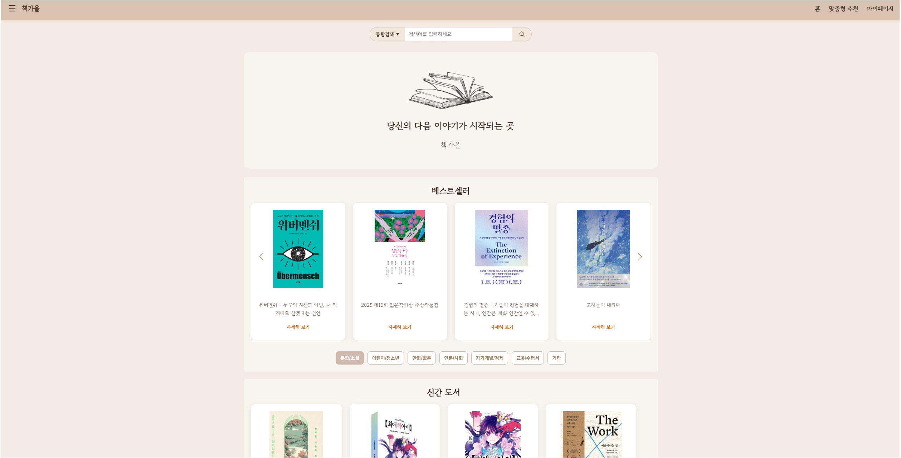
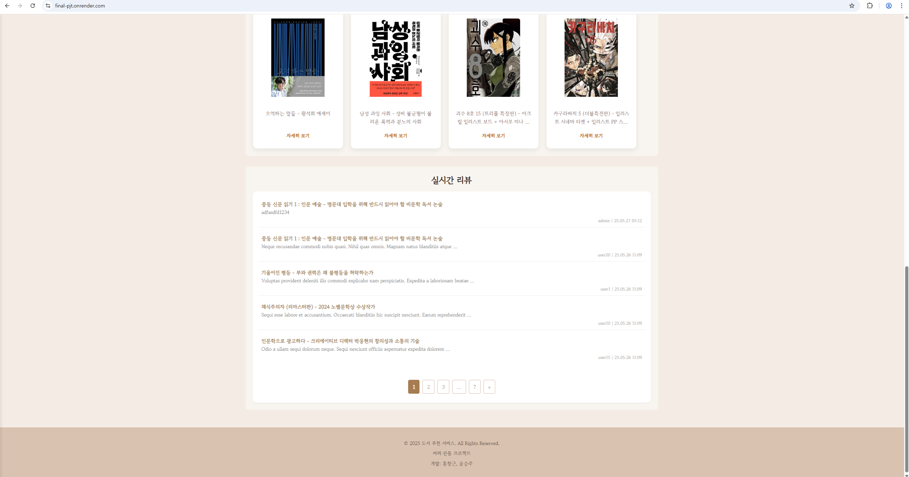
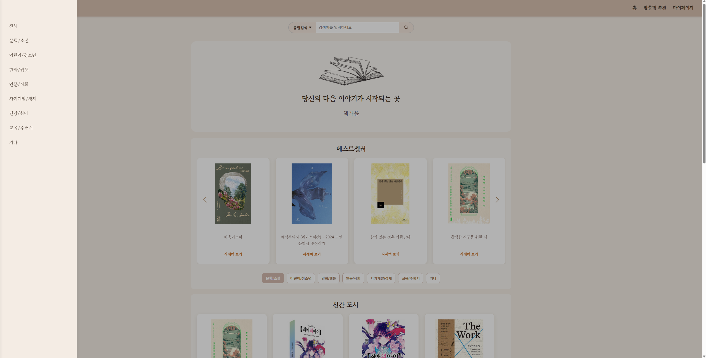
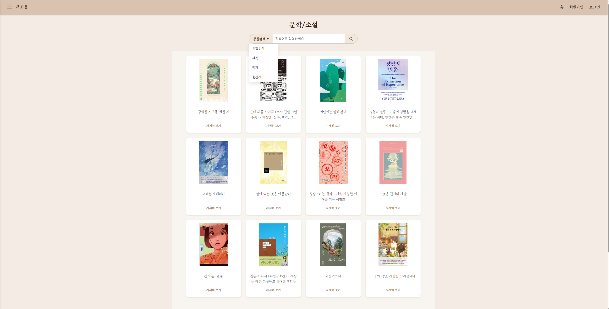
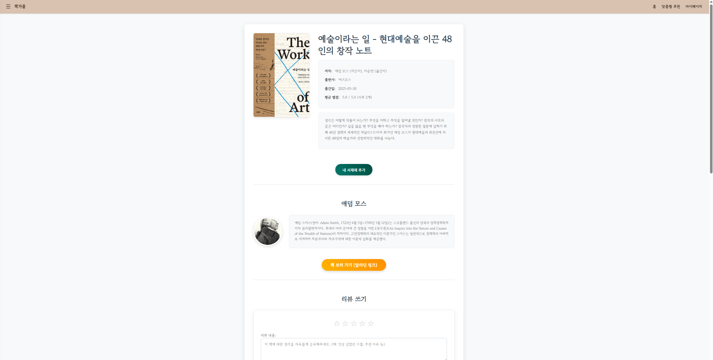
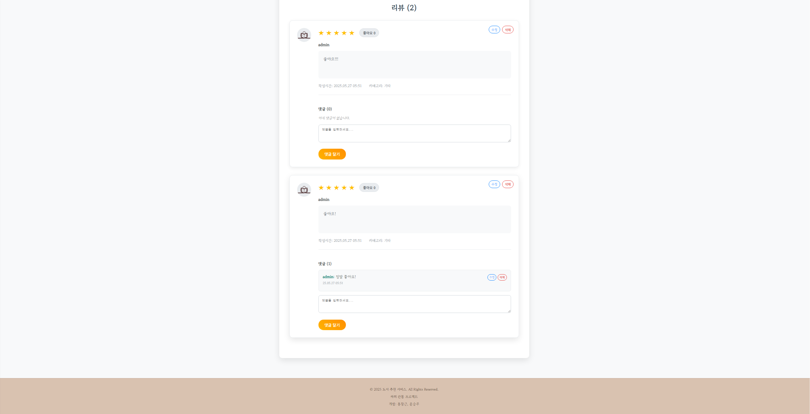
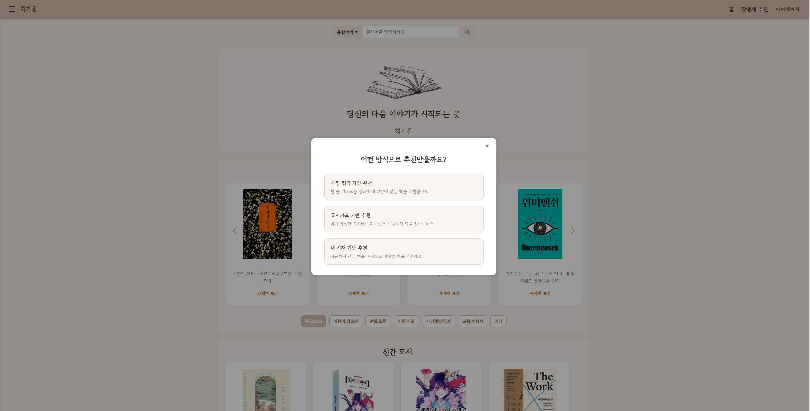
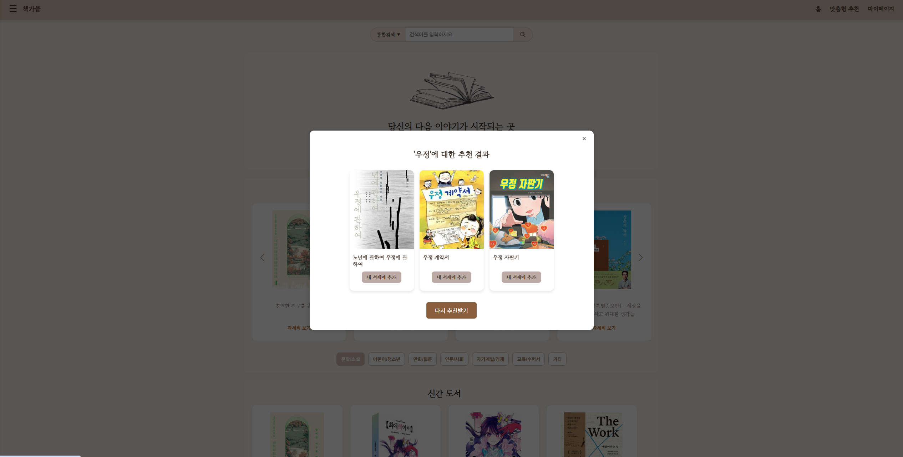
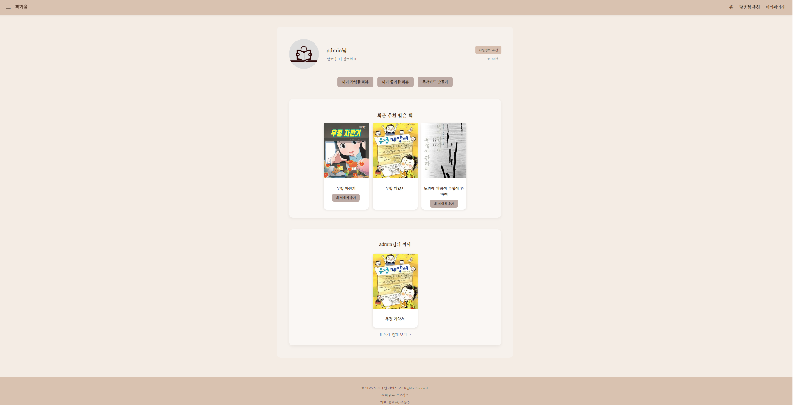
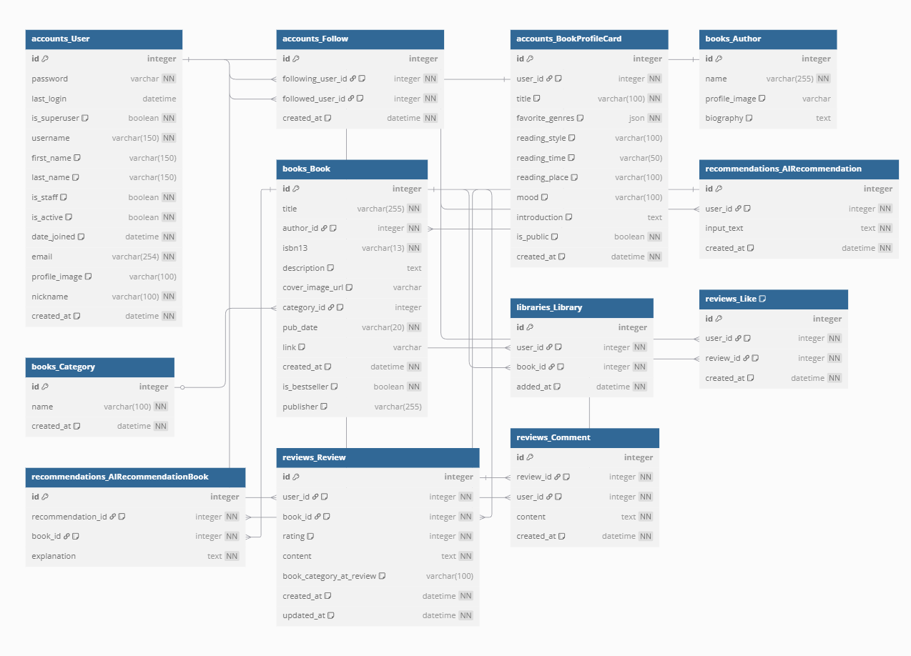

# final_pjt

## 1. 팀원 정보 및 업무 분담 내역

- **팀원**:
  
  - 홍창근
    
  - 윤승주
    
- **업무 분담**:
  
  - **홍창근**: 
     * **도서 정보 시스템 구축**: 도서 데이터베이스 관리, 다양한 조회(목록, 상세, 고급 검색) 및 사용자 친화적 인터페이스를 포함한 핵심 기능을 개발했습니다.
     * **리뷰 플랫폼 개발**: 사용자의 리뷰 작성·수정·삭제(CRUD), 별점 평가, 마이페이지 연동 등 Full-Stack 리뷰 참여 시스템을 구축했습니다.
     * **AI 추천 시스템 연동**: GPT 모델 기반 추천 알고리즘을 실제 서비스에 통합하고, 최적화된 데이터 파이프라인 및 맞춤형 추천 UI/UX를 구현했습니다.
     * **서비스 품질 최적화**: UI/UX 일관성 향상, 프론트엔드/백엔드 성능 최적화, 부가 기능 개발 및 시스템 안정화를 통해 전반적인 서비스 품질을 제고했습니다.
     * **추천 알고리즘 개발 기여**: AI(GPT) 기반 추천 시스템의 핵심 기능 중, 사용자 키워드 분석 로직 및 API 연동 부분의 개발에 참여하고 완성도를 높이는 데 기여했습니다.
  
  - **윤승주**:
    - **사용자 기능 전반 담당**: 회원가입, 로그인, 프로필 이미지 수정, 비밀번호 변경 등 계정 시스템 전반 구현
    - **마이페이지 및 유저페이지 구현**: 내 독서카드, 최근 추천 도서, 서재 미리보기, 내가 쓴 리뷰/좋아요한 리뷰 탭 포함
    - **팔로우 시스템 구축**: 팔로잉/팔로워 기능, AJAX 기반 팔로우 토글 버튼, 팔로우 목록 모달 구현
    - **추천 알고리즘 개발**: GPT 기반 문장 입력/독서카드 기반/서재 기반 3종 추천 로직 설계 및 API 응답 처리
    - **추천 UI 모달 통합**: 기존 추천 모달들을 통합하여 하나의 맞춤형 추천 모달로 구성, 입력/대기/결과 흐름 구성
    - **데이터 수집 및 전처리**: 알라딘 API와 위키피디아 API를 활용한 500권 도서 수집 스크립트 작성 및 작가 정보 정제

## 2. 목표 서비스 구현 및 실제 구현 정도

- **2.1. 목표 서비스**:
  
  - 사용자 입력 키워드(예: '우정', '몰입')의 의미를 분석하여 연관성 높은 도서를 추천하는 기능
    
  - 리뷰 및 댓글 기능을 통한 사용자 간 양방향 소통이 가능한 커뮤니티 환경 조성
    
  - 다양한 카테고리별 도서 검색 및 필터링 기능 제공
    
- **2.2. 실제 구현 정도**

- 메인 페이지에 문구와 베스트셀러, 신간, 실시간 리뷰가 나오게 구현했습니다.
  

- 또한 네이브바를 클릭하면 해당 카테고리 페이지로 이동할 수 있게 했습니다.

- 카테고리 페이지에 들어가면 해당 카테고리의 책들과 '통합검색', '제목','작가', 출판사 별로 검색이 가능하게 구현했습니다.

- 책의 자세히 보기 버튼을 누르면 해당 책의 정보와 리뷰의 평점의 평균, 리뷰를 작성할 수 있게 구성했습니다.

- 또한 각 리뷰의 수정과 삭제가 가능하게 구현했습니다.

- 상단의 '맞춤형 추천'을 누르면 문장 기반, 독서카드 기반, 내 서재 기반에 나눠 책을 추천 받을 수 있게 구현하였습니다.

- 추천이 완료되면 사진과 같이 추천된 책이 뜨게 구현하였습니다.

- 마이페이지는 내가 작성한 리뷰, 좋아요한 리뷰를 볼 수 있게 하고 독서카드도 작성이 가능하게 하였습니다. 또한 맞춤형 추천을으로 추천받은 책들을 보이게 하며 해당 책들은 내 서재에 추가할 수 있게 하였습니다. 또한 팔로잉, 팔로워가 가능하게 지정했습니다.

## 3. 데이터베이스 모델링 (ERD)

## 4. 도서 데이터 수집 방식

- 본 프로젝트에서는 **국내 도서 정보를 확보하기 위해 [알라딘 TTB(Open API)](https://www.aladin.co.kr/ttb/apiintro.aspx)**를 활용하였습니다.
- 수집은 Django 커맨드 스크립트(`fetch_books.py`)를 통해 자동화되어 있으며, 최대 500권까지 수집하도록 설계되어 있습니다.

### 🔹 수집 방식 요약

- **기본 API**: `ItemSearch`, `ItemList` (베스트셀러)
- **검색 키워드**: '사랑', '우정', '몰입', '성장', '추리', '자기계발', '에세이' 등 40개 이상의 키워드를 무작위로 조합하여 검색 요청
- **수집 항목**:
  - 책 제목, ISBN13, 표지 이미지, 책 소개, 출간일, 출판사, 카테고리
  - 작가 이름(복수 가능), 알라딘 책 링크
  - 베스트셀러 여부 (`is_bestseller` 필드로 저장)

### 🔹 데이터 저장 흐름

1. API 요청 → 100권씩 수신
2. ISBN 중복 여부 확인 → 이미 수집된 책은 제외
3. **책 정보 저장**: `books.models.Book` 모델로 저장 (중복 시 update)
4. **작가 정보 추가 수집**:
  - 작가 이름을 기준으로 **Wikipedia API**에 검색 요청
  - 프로필 이미지 및 작가 소개(`biography`) 자동 수집
  - 결과는 `books.models.Author`에 저장
5. **카테고리 자동 생성 및 연결**: 알라딘 카테고리명을 기준으로 `books.models.Category`에 저장

### 🔹 예외 처리 및 안전성

- API 호출 오류, JSON 파싱 실패, 위키 문서 누락 등은 try-except로 예외 처리
- 작가 위키 정보가 없을 경우 해당 책은 저장하지 않음 (품질 확보 목적)

## 5. 도서 추천 알고리즘에 대한 기술적 설명

- **기본 데이터**: 추천의 대상이 되는 책 목록은 Django의 books.models.Book 모델을 통해 데이터베이스에서 실시간으로 조회된 모든 책들의 정보입니다.
  
- **데이터 가공**:
  
  - 각 책의 title (제목)과 description (설명) 필드가 사용됩니다.
  - 제목은 앞뒤 공백이 제거되고, 줄바꿈 문자가 공백으로 치환됩니다.
  - 설명은 내용이 없을 경우 "설명 없음"으로 대체되며, 마찬가지로 전처리 후 앞부분 80자까지만 요약되어 사용됩니다.
  - 이렇게 가공된 책 정보들은 "- 제목: 설명 요약..." 형식의 텍스트 목록(book_list_text)으로 변환됩니다. 이 목록이 LLM에게 제공되는 **추천 가능한 책들의 범위(컨텍스트)**가 됩니다.

- **핵심 엔진**: OpenAI의 gpt-4o-mini
  
- **프롬프트 엔지니어링** : 사용자가 입력한 keyword와 위에서 생성된 book_list_text (제한된 책 목록)를 조합하여 LLM에게 전달할 상세한 **프롬프트(지시문)**를 구성합니다.
  
  - **프롬프트의 주요 지시 사항**:
    
    - 제공된 book_list_text 내에서만 책을 추천할 것 (절대 목록에 없는 책을 지어내지 말 것).
    - 주어진 keyword를 좋아하는 사람에게 어울릴 만한 책 3권을 추천할 것.
    - 책 설명 없이, 정확히 책 제목만 줄 단위로 출력할 것.
    - 다른 부가적인 말(인사, 감상 등)은 절대 포함하지 말 것.
    - 명확한 출력 예시 제공

  - **시스템 역할 부여** : {"role": "system", "content": "당신은 도서 큐레이터입니다."} 메시지를 통해 LLM이 특정 역할을 수행하도록 유도합니다. 이는 응답의 톤앤매너와 전문성에 영향을 줄 수 있습니다.
    
- **추론 및 선택** : gpt-4o-mini 모델은 이 프롬프트를 이해하고, 제공된 책 목록 내에서 사용자의 keyword와 각 책의 제목 및 요약 설명을 비교 분석하여 가장 관련성이 높다고 판단되는 책 3권의 제목을 선택합니다. 이 과정은 LLM의 방대한 사전 학습 데이터와 문맥 이해 능력을 기반으로 이루어집니다.
  
- **매개변수 설정**:
  
  - model="gpt-4o-mini": 비교적 최신의 고성능 소형 모델을 사용하여 비용과 성능의 균형을 맞춥니다.
  - max_tokens=500: 응답의 최대 길이를 제한하여 불필하게 긴 출력을 방지합니다.
  - temperature=0.7: 응답의 창의성(무작위성)을 조절합니다. 0.7은 어느 정도 일관성을 유지하면서도 다양한 추천이 가능하도록 하는 값입니다. (0에 가까울수록 결정론적, 1에 가까울수록 창의적)

- **결과 처리 (Output Processing)**:
  
  - LLM으로부터 받은 응답(텍스트 형태의 책 제목 목록)에서 앞뒤 공백을 제거합니다.
  - 줄바꿈 문자(\n)를 기준으로 각 줄을 분리하여 리스트로 만듭니다.
  - 각 줄(책 제목)의 앞뒤 공백을 다시 한번 제거하고, 빈 줄은 제외하여 최종적으로 추천된 책 제목들의 리스트를 반환합니다.

- **오류 처리 (Error Handling)**:
  
  - OpenAI API 호출 과정에서 발생할 수 있는 예외(네트워크 오류, API 키 오류 등)를 try-except 블록으로 감지합니다.
  - 오류 발생 시 콘솔에 에러 메시지를 출력하고, 빈 리스트([])를 반환하여 시스템의 다른 부분에 오류가 전파되지 않도록 합니다.

## 6. 핵심 기능에 대한 설명

- **AI 기반 키워드 분석 도서 추천**: 사용자가 입력한 특정 키워드의 문맥적 의미를 AI가 분석하여, 사용자 의도와 가장 관련성이 높은 도서를 선별하여 추천합니다.
  
- **사용자 참여형 리뷰 및 커뮤니티**: 사용자는 각 도서에 대한 평점과 상세 리뷰를 작성하여 자신의 경험을 공유할 수 있습니다. 또한, 다른 사용자의 리뷰에 댓글을 남기며 자유롭게 의견을 교환하고 소통하는 커뮤니티 기능을 제공합니다.
  
- **다각적 도서 검색**: 사용자는 도서의 제목, 저자, 출판사 정보를 활용한 개별 검색뿐만 아니라, 여러 조건을 통합한 검색 기능을 이용할 수 있습니다. 더불어, 세분화된 카테고리별 필터링을 통해 원하는 도서를 효율적으로 탐색할 수 있도록 지원합니다.
  

## 7. 생성형 AI를 활용한 부분

- **UI/UX 디자인 개선**: 생성형 AI를 활용하여 CSS 스타일링 및 사용자 인터페이스(UI)의 시각적 디테일과 사용성을 향상시켰습니다.
  
- **백엔드 및 프론트엔드 개발 효율 증진**: 프로젝트 내 복잡한 기능 구현 시, Django 뷰(views) 함수 및 템플릿(templates)의 초기 구조 설계와 코드 초안 작성 과정에서 생성형 AI의 지원을 받아 개발 생산성을 높였습니다.
  
- **코드 검토 및 디버깅 지원**: Django 모델(models), 폼(forms) 등 핵심 로직 작성 완료 후, 생성형 AI를 활용한 코드 리뷰 및 분석을 통해 개발 과정에서 미처 파악하지 못한 잠재적 오류를 사전에 식별하고 수정하여 애플리케이션의 안정성을 강화했습니다.
  

## 8. 기타 (느낀 점, 후기)

- **홍창근**: 이번 프로젝트는 그동안 학습한 웹 개발 지식과 기술을 집약하여 **실제 사용자에게 가치를 제공하는 서비스**를 만들어보는 귀중한 경험이었습니다. 서비스의 기반이 되는 **도서 정보 관리 및 사용자 리뷰 기능을 직접 구현**하면서, **안정적인 데이터 처리**와 **사용자 친화적인 인터페이스 설계**의 중요성을 현장에서 깊이 체감할 수 있었습니다. 특히 **AI(GPT) 기반 추천 알고리즘의 핵심 로직 개발에 직접 참여**하여, 사용자 **키워드 분석 및 API 연동 부분을 설계하고 구현**하면서 AI 기술을 **실용적인 서비스 기능으로 전환하는 과정**을 생생하게 경험했습니다. 이렇게 개발하고 통합한 추천 기능을 통해 **데이터가 어떻게 수집, 분석되어 사용자 맞춤 경험을 창출**하고, 이것이 곧 **서비스의 핵심 경쟁력**으로 이어질 수 있는지를 명확히 이해하게 되었습니다. 뿐만 아니라, 프로젝트 개발 과정 전반에 걸쳐 **생성형 AI를 적극적으로 활용**하여 **복잡한 기술적 난관을 해결하고 개발 생산성을 크게 향상**시킬 수 있었으며, 이 경험은 AI가 앞으로 **창의적 문제 해결과 개발 혁신을 위한 강력한 동반자**가 될 것이라는 확신을 주었습니다.

- **윤승주**:이번 프로젝트는 단순한 기능 구현을 넘어, **실제 사용자 경험과 서비스의 가치를 고려한 전체 흐름을 설계하고 책임지는 경험**이었습니다. 사용자 계정 시스템을 비롯해 마이페이지, 팔로우, AI 기반 추천 알고리즘까지 **사용자 중심 기능 전반을 직접 구현**하면서 한층 더 깊은 이해와 실력을 쌓을 수 있었습니다.특히, **GPT 기반 도서 추천 시스템**을 설계하고 세 가지 추천 로직을 통합하는 과정은 가장 도전적이면서도 보람 있는 작업이었습니다. 단순히 결과를 출력하는 것이 아니라, 추천 흐름의 입력 → 대기 → 출력까지 **하나의 사용자 경험으로 설계**하고, 그 안에서 API 오류나 UX 불편 등을 끊임없이 개선했습니다. 이 과정에서 **비동기 처리, 프론트-백엔드 연동, LLM 프롬프트 엔지니어링**에 대한 실무적인 감각도 크게 향상되었습니다.또한, **팔로우 시스템과 마이페이지 구현**을 통해 사용자 간의 상호작용 흐름을 직접 설계하고, Ajax 기반의 동적 UI 구현을 익히며 **실시간성과 사용자 편의성 사이의 균형**을 고민했습니다. '내가 만든 서비스에 누군가가 참여하고 반응한다'는 것을 눈으로 확인하며, 개발자의 역할과 책임에 대해 다시금 생각하게 되었습니다.무엇보다, 이번 프로젝트에서 가장 크게 느낀 점은 **생성형 AI의 가능성**입니다. 단순히 코드를 생성하는 도구를 넘어, 설계 단계에서의 아이디어 확장, 복잡한 로직의 구조화, 에러 디버깅 등 다양한 과정에서 **AI와의 협업**이 개발 효율을 눈에 띄게 높여주었습니다. 앞으로의 개발자 역량은 **기술을 익히는 것뿐 아니라, 이를 잘 다루고 조율하는 능력**에 달려 있다는 사실도 절실히 깨달았습니다.이번 경험은 단순한 결과물이 아닌, 개발자로서의 태도와 문제 해결력을 키운 값진 시간이었습니다.

## 9. 배포 서버 URL

- [https://final-pjt.onrender.com](https://final-pjt.onrender.com)
