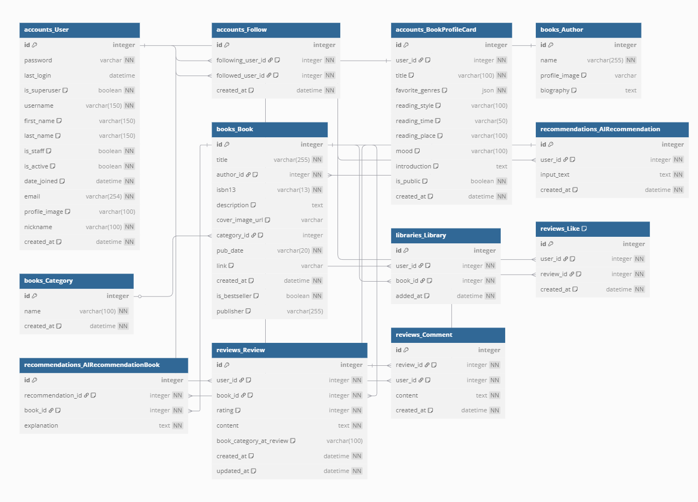

# final_pjt

## 1. 팀원 정보 및 업무 분담 내역

- **팀원**:

    * 홍창근

    * 윤승주

- **업무 분담**:

    * **홍창근**: 도서(Books) 및 리뷰(Reviews) 관련 기능 개발, 추천(Recommendations) 시스템, static 추가 및 개선

    * **윤승주**: 마이페이지, 계정, 추천 알고리즘 작성, 데이터 추출

## 2. 목표 서비스 구현 및 실제 구현 정도

- **2.1. 목표 서비스**:

    * 사용자 입력 키워드(예: '우정', '몰입')의 의미를 분석하여 연관성 높은 도서를 추천하는 기능

    * 리뷰 및 댓글 기능을 통한 사용자 간 양방향 소통이 가능한 커뮤니티 환경 조성

    * 다양한 카테고리별 도서 검색 및 필터링 기능 제공

- **2.2. 실제 구현 정도**:

    * 키워드 기반 도서 추천 기능: 사용자 입력 키워드에 따른 맞춤형 도서 추천 기능 구현 완료.

    * 리뷰 및 커뮤니티 기능:

        * 메인 페이지에서 최신 리뷰를 실시간으로 확인할 수 있는 피드 기능 구현.

        * 사용자는 도서별 리뷰와 댓글을 작성, 수정, 삭제할 수 있으며, 이를 통해 상호작용 가능.

    * 도서 검색 기능:
        * 제목, 저자, 출판사별 개별 검색 및 통합 검색 기능 구현 완료.
        * 
        * 전체 도서 목록 조회 및 카테고리별 도서 필터링 기능 구현 완료.

## 3. 데이터베이스 모델링 (ERD)

## 4. 도서 추천 알고리즘에 대한 기술적 설명

- *[개발하신 도서 추천 알고리즘에 대해 상세히 설명해주세요. 어떤 데이터를 기반으로, 어떤 방식으로 추천이 이루어지는지 등을 포함하면 좋습니다.]*

## 5. 핵심 기능에 대한 설명

    * **AI 기반 키워드 분석 도서 추천**: 사용자가 입력한 특정 키워드의 문맥적 의미를 AI가 분석하여, 사용자 의도와 가장 관련성이 높은 도서를 선별하여 추천합니다.

    * **사용자 참여형 리뷰 및 커뮤니티**: 사용자는 각 도서에 대한 평점과 상세 리뷰를 작성하여 자신의 경험을 공유할 수 있습니다. 또한, 다른 사용자의 리뷰에 댓글을 남기며 자유롭게 의견을 교환하고 소통하는 커뮤니티 기능을 제공합니다.

    * **다각적 도서 검색**: 사용자는 도서의 제목, 저자, 출판사 정보를 활용한 개별 검색뿐만 아니라, 여러 조건을 통합한 검색 기능을 이용할 수 있습니다. 더불어, 세분화된 카테고리별 필터링을 통해 원하는 도서를 효율적으로 탐색할 수 있도록 지원합니다.

## 6. 생성형 AI를 활용한 부분

    * **UI/UX 디자인 개선**: 생성형 AI를 활용하여 CSS 스타일링 및 사용자 인터페이스(UI)의 시각적 디테일과 사용성을 향상시켰습니다.

    * **백엔드 및 프론트엔드 개발 효율 증진**: 프로젝트 내 복잡한 기능 구현 시, Django 뷰(views) 함수 및 템플릿(templates)의 초기 구조 설계와 코드 초안 작성 과정에서 생성형 AI의 지원을 받아 개발 생산성을 높였습니다.

    * **코드 검토 및 디버깅 지원**: Django 모델(models), 폼(forms) 등 핵심 로직 작성 완료 후, 생성형 AI를 활용한 코드 리뷰 및 분석을 통해 개발 과정에서 미처 파악하지 못한 잠재적 오류를 사전에 식별하고 수정하여 애플리케이션의 안정성을 강화했습니다.

## 7. 기타 (느낀 점, 후기)

    * **홍창근**: 프로젝트를 통해 그동안 학습한 웹 개발 지식과 기술을 실제 서비스 구현에 적용해보는 소중한 경험을 했습니다. 특히 도서 추천 알고리즘을 직접 설계하고 구현하는 과정에서 알고리즘의 작동 원리와 데이터 처리 방식에 대한 이해를 한층 심화시킬 수 있었습니다. 또한, 개발 과정 전반에 걸쳐 생성형 AI를 적극적으로 활용하며, AI가 개발 생산성과 문제 해결 능력을 향상시키는 강력한 협업 파트너가 될 수 있음을 다시 한번 체감했습니다.

## 8. 배포 서버 URL (배포했을 경우)

- *[프로젝트를 웹에 배포했다면 해당 URL을 기재합니다. 아직 배포하지 않았거나 로컬 환경에서만 실행했다면 "해당 없음" 또는 생략 가능합니다.]*